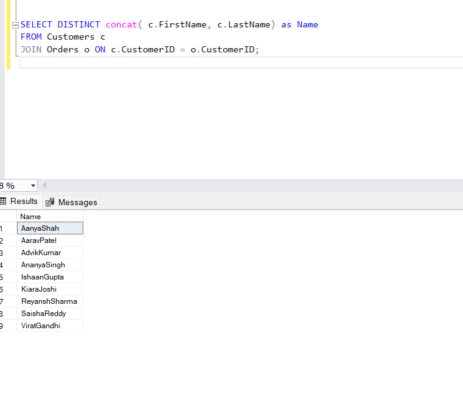

```sql
--Question-1:

--The concat()-function can add the two strings and returns it.
--Query:

SELECT concat(FirstName, LastName) as Name, Email
FROM Customers;
```


```sql
--Question-2:
--List all orders with their order dates and corresponding customer names:
--used the inner join on orders table on common customerID coloumn
--Query:
SELECT o.OrderID, o.OrderDate, CONCAT(c.FirstName, ' ', c.LastName) AS CustomerName
FROM Orders o
INNER JOIN Customers c ON o.CustomerID = c.CustomerID;

```


```sql
--Question-3:
--Insert a new customer record into the "Customers" table:
--Query:
INSERT INTO Customers (CustomerID, FirstName, LastName, Email, Phone, Address)
VALUES (9,'Virat', 'Gandhi','virat.gandhi@example.com','8936457890','345 Pine St');
```


--coloumn inserted:


```sql
--Question-4:
--Update the prices of all electronic gadgets in the "Products" table by increasing them by 10%:

--Here 10% means multiply by 1.1*(previous value);
--Query:
UPDATE Products
SET Price = Price * 1.1
WHERE ProductID IN (1, 2, 3, 4, 5, 6,7,8);
-- Assuming these are electronic gadgets
```


```sql
--Question-5:
--Delete a specific order and its associated order details from the "Orders" and "OrderDetails" tables:
--Query:
DELETE FROM OrderDetails
WHERE OrderID = 2;
--The row/record containing orderId-2 would be deleted
DELETE FROM Orders
WHERE OrderID = 2;
```


```sql
--Question-6:
--Insert a new order into the "Orders" table:
--Query:
INSERT INTO Orders (OrderID,CustomerID, OrderDate, TotalAmount)
VALUES (9,9, '2024-06-09', 400.00);
 -- Example order for customer ID 3 on June 9th, 2024
```


```sql
--Question-7:
--Update the contact information of a specific customer in the "Customers" table:
--Query:
UPDATE Customers
SET Email = 'new.email@example.com', Address = '456 Oak St'
WHERE CustomerID =5;
--the data has been updated for the customerId-5
```


```sql
--Question-8:
--Recalculate and update the total cost of each order in the "Orders" table:
--Query:
UPDATE Orders
SET TotalAmount = (
    SELECT SUM(od.Quantity * p.Price)
    FROM OrderDetails od
    INNER JOIN Products p ON od.ProductID = p.ProductID
    WHERE od.OrderID = Orders.OrderID
)
WHERE OrderID IN (SELECT OrderID FROM OrderDetails);


select * from Orders
```


```sql
--Question-9:
--Delete all orders and their associated order details for a specific customer:
--Query:
DELETE FROM OrderDetails
WHERE OrderID IN (
    SELECT OrderID
    FROM Orders
    WHERE CustomerID =6
);

select * from OrderDetails
```


```sql
---Question-10:
--Insert a new electronic gadget product into the "Products" table:
--Query:

INSERT INTO Products (ProductID, ProductName, Description, Price)
VALUES (10,'Smart Speaker', 'Voice-controlled smart speaker', 120.00);
select * from Products
```


```sql
--Question-11:
--Update the status of a specific order in the "Orders" table:
--Query:
UPDATE Orders
SET OrderDate = '01-01-2023'
WHERE OrderID = 8;
select * from Orders
```


```sql
--Question-12:
--Calculate and update the number of orders placed by each customer in the "Customers" table:
--Query:
SELECT c.CustomerID, c.FirstName, c.LastName, COUNT(od.Quantity) AS NumOrders
FROM Customers c
LEFT JOIN Orders o ON c.CustomerID = o.CustomerID
inner join OrderDetails od on od.OrderID=o.OrderID
GROUP BY c.CustomerID, c.FirstName, c.LastName;
```


```sql
--Question-13:
--Retrieve a list of all orders along with customer information:
--Query:
Select o.OrderID, o.OrderDate, CONCAT(c.FirstName, ' ', c.LastName) AS CustomerName, c.Email, c.Phone
FROM Orders o
INNER JOIN Customers c ON o.CustomerID = c.CustomerID;
```


```sql
--Question-14:
--Find the total revenue generated by each electronic gadget product:
--Query:
SELECT p.ProductName, SUM(od.Quantity * p.Price) AS TotalRevenue
FROM OrderDetails od
INNER JOIN Products p ON od.ProductID = p.ProductID
GROUP BY p.ProductName;
```


```sql
--Question-15:
--List all customers who have made at least one purchase:
--Query:
SELECT DISTINCT concat( c.FirstName, c.LastName) as Name
FROM Customers c
JOIN Orders o ON c.CustomerID = o.CustomerID;
```


